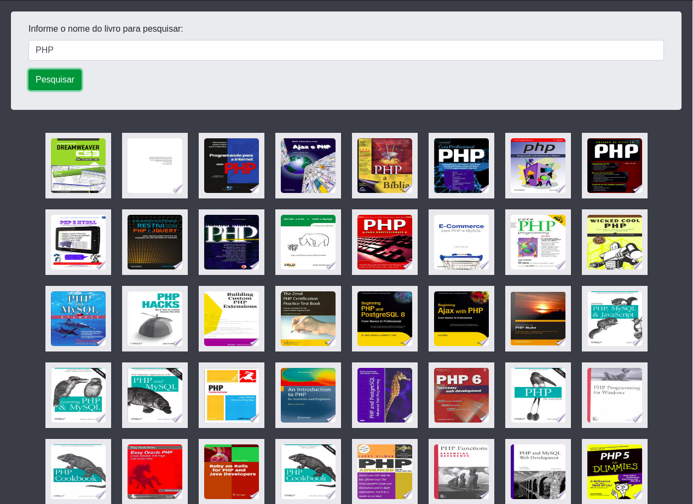

# Projeto Scanner Livros:

* Projeto para treinamento em reactjs
* O projeto consiste em mostrar para usuário o livro da pesquisa.

* Dentro do <b>README</b> da pasta do projeto está tudo que está sendo usando.
   * https://github.com/thiagoadssilva/thiagoScannerLivros/blob/main/frontend/README.md

## <b>Cadastrar Tarefa</b> 

